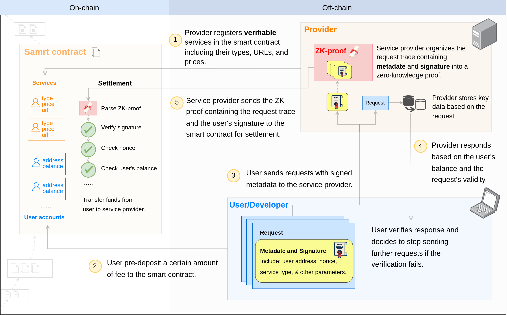

The 0G Serving Network is designed to seamlessly connect service providers with service users, making it easy for anyone capable of providing services to reach potential customers. It supports AI service providers by integrating with various AI services, enabling them to charge for their offerings while ensuring that the services delivered to users are verifiable.

## Components

**Contract:** This component stores key variables during the service process, including account information, service details (such as name and URL), and consensus logic. It determines the legitimacy of settlement proofs, manages accounts, and handles service information.

**Provider:** These are the owners of models and hardware who offer their services to earn revenue.

**User Broker:** These individuals use the services. They can either directly access the provider's services or use these services to develop their own applications.

## Process Overview

Here's a concise description of how the 0G Serving Network operates:

1. **Service Registration**
   - Providers register their services' types, URLs, and prices in the smart contract.
2. **User Pre-Deposit**
   - Users pre-deposit a certain amount into the smart contract to cover service fees.
3. **Request Submission**
   - Users or developers send requests, along with metadata and signatures, to the service provider.
4. **Provider Response**
   - Providers respond based on the user's balance and the request's validity.
5. **Settlement and Verification**
   - Providers generate a zero-knowledge proof (ZK-proof) and submit it to the smart contract for verification and settlement.
6. **User Verification**
   - Users verify the provider's response and can stop requests if the verification fails.

This brief overview introduces the foundational workflow. For more detailed steps, please refer to the full documentation.

## Get Involved

If you're interested in becoming a **Provider**, please refer to [the Provider section](./provider.md) for detailed guidelines and requirements.

If you wish to leverage provider services to develop your own projects, relevant resources are available in [the Developer SDK section](./developer-sdk).

For those looking to directly access services from a **Provider**, more information can be found in [the Marketplace section](./marketplace.md).
